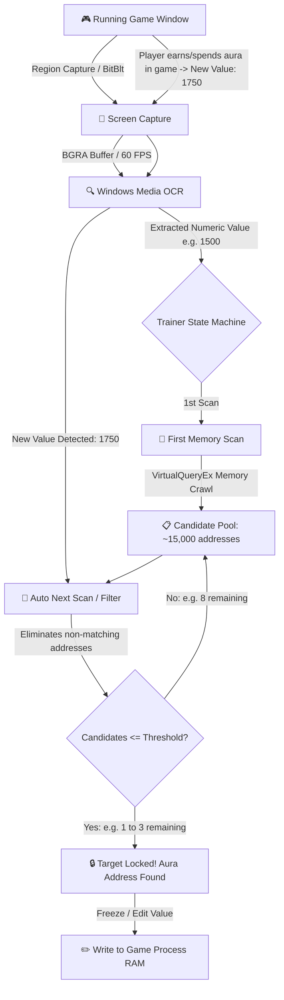

# AutoTrainer 🎮⚡

**AutoTrainer** is a high-performance native Windows application built with **C++20**, **DirectX 11**, and **Dear ImGui**. It combines **real-time screen region capture**, **optical character recognition (Windows Media OCR)**, and a **multi-threaded asynchronous memory scanning engine** to automatically locate and narrow down in-game variables (such as aura balance, gold, health, or mana) in process memory.

---

## 🚀 How It Works



---

## ✨ Key Features

1. **Interactive Visual Screen Capture**:
   - On-screen click-and-drag rubberband selection tool (`🎯 Select Region On Screen`).
   - Fine manual coordinate controls (X, Y, Width, Height).
   - Supports absolute desktop coordinates or offsets relative to the game window.
   - Real-time video preview feed with optional image pre-processing (Grayscale, Binary Thresholding, and Color Inversion).

2. **Hybrid Optical Character Recognition (OCR)**:
   - Native integration with the **Windows.Media.Ocr (WinRT)** API in Windows 10/11 (high accuracy and minimal latency).
   - Built-in topological fallback digit recognizer for stripped Windows versions without language packs.
   - Smart number parser (handles thousands separators, decimal points, and negative values).
   - Multi-frame temporal stability validation (prevents false reads during in-game rolling number animations).

3. **Fast Memory Scanner Engine (Cheat Engine Style)**:
   - Supports both **32-bit (x86)** and **64-bit (x64)** target processes.
   - Supported data types: **Int32 (4 Bytes)**, **Int64 (8 Bytes)**, **Float (4 Bytes)**, and **Double (8 Bytes)**.
   - Block-based First Scan with continuous page discovery (`PAGE_READWRITE`, `PAGE_EXECUTE_READWRITE`).
   - Ultra-fast Next Scan (Filtering) iterating strictly across surviving candidate addresses.
   - Asynchronous background worker thread with progress reporting and cancellation support.

4. **Continuous AutoTrainer Mode (Auto-Scan)**:
   - Automatically monitors the on-screen aura counter.
   - Whenever the aura value changes in the game (e.g., buying an item or defeating an enemy), AutoTrainer automatically triggers the Next Scan filter.
   - Continuously repeats until candidate addresses are narrowed down to the target threshold (e.g., 1 to 3 addresses).
   - Visual status banner and instant address locking.

5. **Value Freezing and In-Memory Editing (Freeze & Write)**:
   - Live candidates table displaying current memory values, previous values, and hex addresses in real time.
   - **Freeze** checkbox powered by a dedicated high-frequency lock thread.
   - In-place **Edit** modal dialog with quick preset buttons (`+500`, `+5,000`, `999,999`, `Max 32-bit`) and keyboard shortcut support (`Enter` to apply).

6. **Included Test RPG Game (`MockGame.exe`)**:
   - Bundled mock RPG game to test and verify the entire end-to-end workflow immediately without external games.

---

## 🛠️ How to Build with `build.bat`

Run [`build.bat`](file:///C:/Users/User/Documents/VsCode/AutoTrainer/build.bat) by double-clicking it or executing it via command prompt:
```cmd
build.bat
```

The script automatically detects your Visual Studio 2022 installation, configures the x64 environment, compiles resources (`version.rc`), and outputs:
- `AutoTrainer.exe`
- `MockGame.exe`

---

## 📖 Step-by-Step Usage Guide

1. Launch `MockGame.exe`. You will see a test RPG window displaying `AURA BALANCE: 1500`.
2. Launch `AutoTrainer.exe`.
3. In the top bar, select `MockGame.exe` from the process dropdown and click **Attach**.
4. In the left panel, click **🎯 Select Region On Screen** and drag a rectangle over the number `1500` in the game.
5. The live region feed will show the cropped number, and the OCR engine will recognize `1,500`.
6. Click **▶ Start AutoTrainer (Continuous Auto-Scan)**:
   - AutoTrainer runs the initial 1st Scan for `1500`.
   - The status updates to *"Waiting for Aura to change in game..."*.
7. In `MockGame`, press **[Spacebar]** (increases aura to `1750`).
8. AutoTrainer automatically detects the new value via OCR and performs the **Next Scan** filter.
9. Press **[Spacebar]** once or twice more if needed until the status changes to **Target Address Locked!**.
10. In the candidates table, check **Freeze** to lock the aura, or click **Edit** to set the balance to `999999` and watch the game update instantly!
